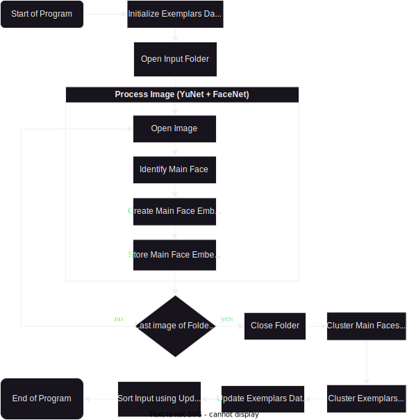

# Cluster Face
**Version 1.0.0**
## Sorting Images by Face via Face Clustering

### Description
Cluster Face is a program that sorts images based on the faces in it. It sorts the images by clustering the extracted face using Affinity Propagation and then, using the data on previous runs of the program, names it appropriately (as accurately as it can).

### Motivation of Project
There were times in which I had to sort hundreds of images by face in order to easily and efficiently give it to the respective people in the photo. Doing so took me so much time, and so I wanted to remove most of that by automating it via face clustering.

### What does it do?
**Version 1.0.0**

***New Features:*** *None (first version)*

The main thing the Cluster Face does is it sorts the images by the faces contained in it.

### How to download?
First create a virtual environment in your preferred location and access it. Run the following command to download the packages in the requirements.txt

``` pip install -r requirements.txt ```

### Usage
Place your images inside the input directory and then run `python main.py` in the terminal to sort the images into the output directory.

Make sure it to clear everything in the output folder beforehand as it might replace old images that have the same filename as the new ones.

### How it works?

The program follows the flowchart above.

The main idea of this program is to associate an image with a feature vector or a vector representation of the image (or part of it). The feature vector of our image is the embeddings of the main face. Embeddings are like signatures, they are used to discern or find the similarities of the images based on the distances they have on other embeddings. We then cluster these feature vectors, to see which embeddings are close to one another. Based on the found clusters of feature vectors, we then rearrange the images in the input directory to the output directory, essentially sorting it.

### Decisions
(1) Face Detection:<br>For this project, I used a DNN based approach as opposed to Haar-Cascade because I wanted each face to have some sort of confidence value in order to identify a 'representative face' for each image. If there are multiple faces in the camera, the representative face is the face that is most visible and most clear to the camera. It makes it easier to sort images as each image will then correspond to one respective name. The model I used is YuNet. I choose this model specifically for 2 reasons. One, is that it is the model that pops up in the OpenCV documentation. Two, is that it can detect faces even with masks on, which is very welcome feature to have.

(2) Clustering Algorithm:<br>For the clustering algorithm, I chose Affinity Propagation (AP) due to its ability to cluster data without specifying how many clusters you want. This is really needed especially since we don't know how many unique faces we have in our pictures. Another reason I chose AP was because of its inherent trait to have exemplars. Having that in mind, I got the idea of using the exemplars of the previous run of the program to identify the faces on the current run, and then having the images be sorted according to the name of the person on the image instead of just numbers.

### Plans on the future:
I will probably not be working on it actively as I also wanted to create other projects. However, like all my previous projects, I might edit them to fix known issues or add something useful, whatever it may be.

One thing I'll do though is fix known issue #1 (soon, next weekend, or maybe later idk).

### Known Issues:
(1) The code to identify the main face isn't to accurate. A suggestion to make it better would be add heuristics. Two heuristics I can think of is: size and position. Starting with size, the bigger the face is, the higher its heuristic value. Next for the position, the closer the face is to the center or those grid line intersections you can see in phones, the higher the heuristic value. The effect of size would be bigger compared to the position as I think the position is an ambigouos way to identify who is being photographed as there are multiple good positions to consider.

(2) I couldn't guarantee that the exemplars of the old iteration would not combine in cluster with each other in the next iteration. Nor can I ensure that the new exemplars of the current iteration will not combine with each other in the next iteration (the 2nd Affinity Propagation (AP)).

---

## License & Copyright
See the [LICENSE](LICENSE.md) file for license rights and limitations (MIT).
